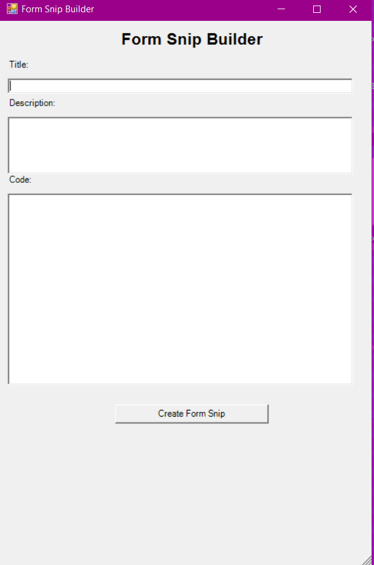

# Powershell-Console-Form-Builder (PCFB)

Powershell-Console-Form-Builder (PCFB) is a PowerShell module that allows for the quick and easy creation of graphical user interfaces (GUIs) using the System.Windows.Forms namespace. This module provides a streamlined way to reference the description and example of each class that exists in the Forms namespace, as well as the ability to quickly copy the example code to be added to your project.

## Usage

The module provides the following commands:

- `Get-FormCommand -Run <form_snip>`: Runs the example of the specified form snippet.
- `Get-FormCommand -Example <form_snip>`: Displays the example of the specified form snippet in the console.
- `Get-FormCommand -Copy <form_snip>`: Copies the example of the specified form snippet to the clipboard.
- `Get-FormCommand -Description <form_snip>`: Displays the description of the specified form snippet in the console.

`<form_snip>` should be the path to the form snippet file, for example:

```powershell
Get-FormCommand -Run 'Button'
Get-FormCommand -Example 'Button'
Get-FormCommand -Copy 'Button'
Get-FormCommand -Description 'Button'
```

## Examples

You can see examples of usage of this module in the examples folder of this repository.

## Requirements

- PowerShell v5.1 or later

## Installation

You can install this module from the PowerShell Gallery by running the following command:

Install-Module -Name Powershell-Console-Form-Builder

Alternatively, you can download the module from this repository and place it in your `$env:PSModulePath` directory.


<H1>Powershell Console Form Builder</H1>


